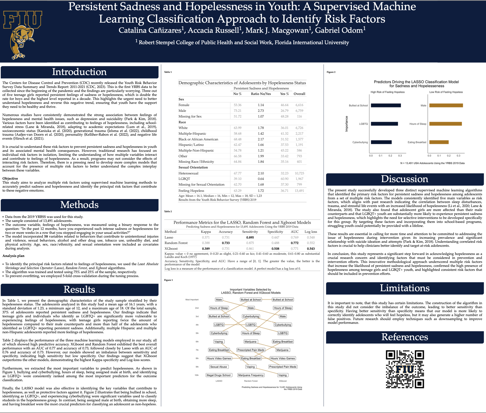

## POSTER: Hopelessness in Youth: A Supervised Machine Learning Classification Approach to Identify Risk Factors

**Catalina Cañizares**

This repository comprises the code I used to develop the poster I will present at the upcoming Society for Prevention Research conference in Washington DC. Please note that the code cannot run independently as it sources other files from the models I have created, which are not publicly available yet.

If you're interested in learning more about how I developed the poster or would like to collaborate on future projects, please feel free to contact me at ccani007@fiu.edu. While the code may not be directly applicable, I'm happy to discuss my process and share insights with you.

